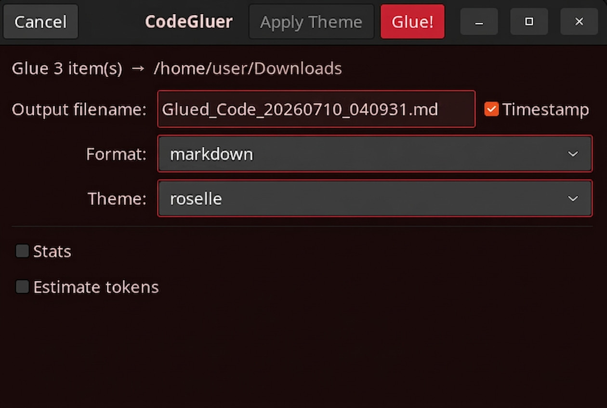
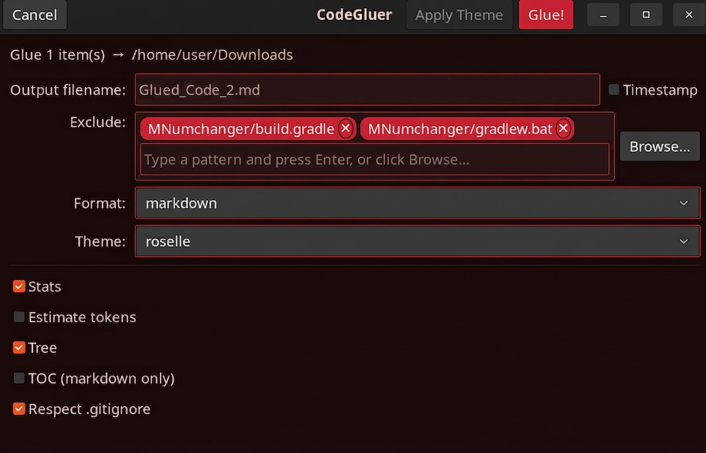
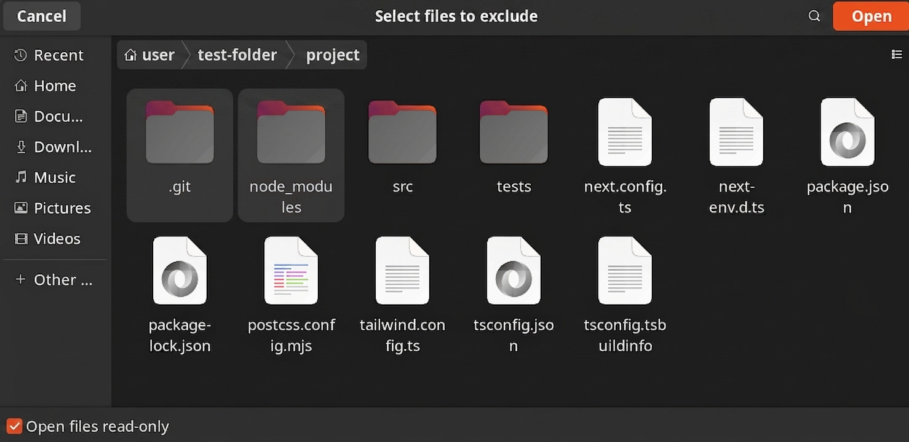
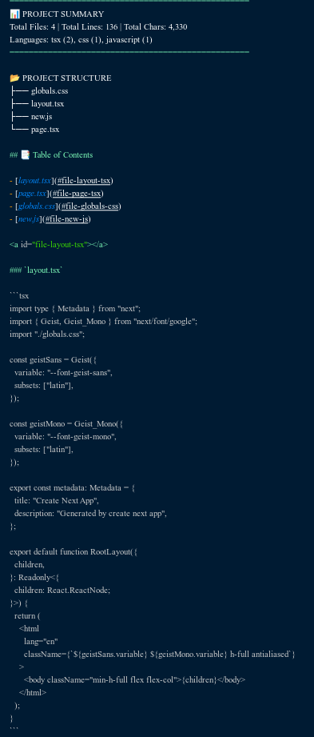
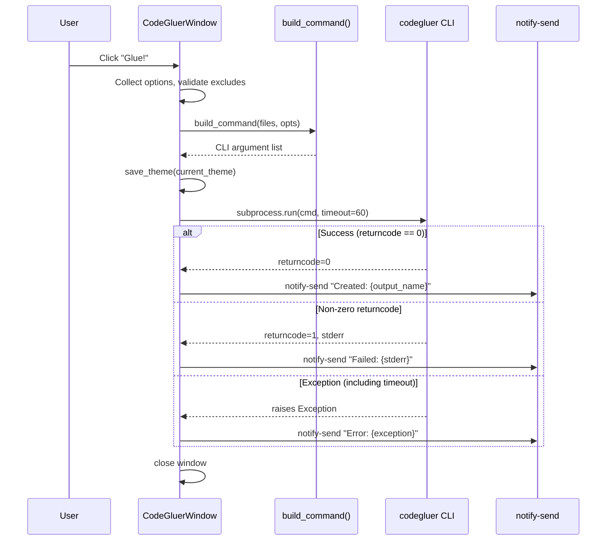

# 📦 CodeGluer

[](https://opensource.org/licenses/MIT)
[](https://www.python.org/)
[](https://github.com/fathriAbanoub/codegluer/releases)

Glue multiple code files (and entire directories) into a single `.txt` or `.md` file.

Perfect for sharing code context with AI assistants, code reviews, documentation, or archiving full projects.

## ✨ Features

- 📁 **Select & Glue** – Select files in your file manager, right‑click, and glue them instantly.
- 🖱️ **GTK4 GUI Dialog** – Native configuration window to set format, exclude patterns, and toggle options before gluing.
- 🏷️ **Exclude Chips** – Exclude patterns show as removable tags, not a plain text field — type a pattern and press Enter, or pick paths visually with **Browse…**.
- 🕐 **Timestamp Option** – Toggle a checkbox next to the output filename to include the current date and time (`YYYYMMDD_HHMMSS`) in the default name. Live-updates as you toggle, and respects custom names you've typed.
- 🖱️ **Scoped Browse Button** – Browse opens anchored inside your selected folder (never your whole filesystem), and rejects picks outside it, absolute paths, `~` paths, and `..` escapes as likely mistakes.
- 🗜️ **Zip Support** – Pass a `.zip` as an input path (CLI or GUI) and its contents are glued directly; GitHub-style zips with a single top-level folder are auto-unwrapped, with zip‑slip protection and a size guard against oversized archives.
- 🎨 **Theme Support** – Choose from **auto** (follows system theme), **light**, **dark**, or **roselle**; persists across sessions.
- 📂 **Directory Recursion** – Pass a folder and use `-r` to recursively grab all files inside.
- 🛡️ **Safety Guards** – Recursive glues auto-skip common dependency/build folders (`node_modules`, `.git`, `dist`, `build`, `.venv`, `vendor`, and more — see [Safety & Performance Guards](#safety--performance-guards)) and abort past a 20MB default size cap, both overridable via `--no-default-ignore` and `--max-size`.
- 🏷️ **Clear Markers** – Each file gets a `BEGIN FILE` / `END FILE` header and footer (Plain mode).
- 📝 **Markdown Mode** – Output pasteable code blocks with syntax highlighting for AI/Notion workflows.
- 🙈 **`.gitignore` Support** – Use `--respect-gitignore` to automatically exclude ignored files (anchored patterns like `/build/` are respected correctly, matching only at the `.gitignore`'s own level).
- 🎯 **Smart Filtering** – Use `--include` and `--exclude` with advanced glob patterns (e.g., `--exclude "node_modules/**"`).
- 🌳 **Tree Output** – Include a directory tree summary with `--tree` (use `--tree-depth` and `--tree-max-files` to limit).
- 📊 **Stats & Token Estimates** – Show file counts, line counts, and token estimates (powered by `tiktoken` if installed). The estimate also categorises the total size into tiers (Small, Medium, Large, Very Large) for quick context‑window assessment.
- 🔍 **Priority Order** – Control file ordering with `--priority` (glob patterns that appear first).
- 🚫 **`.codegluerignore`** – Project‑specific ignore rules (same format as `.gitignore`).
- 🔬 **Binary File Detection** – Skips files containing null bytes (binary) to avoid gluing garbage.
- 🖱️ **Right‑Click Integration** – Works seamlessly from Nautilus (GNOME) and Nemo (Cinnamon) context menus.
- 🔔 **Desktop Notifications** – Get notified when the GUI operation completes.
- 💻 **CLI Support** – Use it from the terminal with powerful options.
- ⏱️ **Auto‑Timestamping** – Prevents accidental overwrites for default outputs by appending microsecond timestamps (explicit `--output` paths will still overwrite).
- 📤 **Pipe to stdout** – Use `-o -` to write the glued content to standard output for piping to other tools.

## 🖼️ See it in action

**Smart GUI adapts to your selection:**

_When selecting files (directory-only options hidden):_



_When selecting a directory (Tree, TOC, .gitignore, and the exclude-chip row with Browse… appear):_



**Browse stays scoped to your project, even with `.git`/`node_modules` present:**



**Clean, pasteable output:**

_Shows stats, tree, TOC, and syntax-highlighted code:_



## 🐧 Why CodeGluer?

Most context-prep tools are built for macOS or run in VS Code. CodeGluer is built for **Linux desktop users**:

- **Native right-click integration** for Nautilus (GNOME) and Nemo (Cinnamon) — no terminal needed.
- **GTK4 native GUI** – clean, fast, and fits your desktop theme.
- **Pipe-friendly CLI** (`-o -`) for scripting and LLM piping workflows.
- **One‑command install** via `pipx` (or `pip --user` fallback) with no Node.js, no npm, and zero required configuration.

If you live in a Linux file manager and want to send code to an AI without leaving your workflow, CodeGluer is the tool for that.

## 📦 Dependencies

- **Python 3.8+**
- **pathspec** – Required for `.gitignore` support and advanced globbing (`**/*.py`).
- **PyGObject (GTK4 bindings)** – Required for the GUI. Install system‑wide:
  ```bash
  sudo apt install python3-gi gir1.2-gtk-4.0   # Debian/Ubuntu
  ```
- **tiktoken** – Optional; provides accurate token estimation. If not installed, a fallback `len(text)/4` is used. Install with `pip install tiktoken` or via the `ai` extra: `pip install codegluer[ai]`.

_Note: `pathspec` is automatically installed as a core dependency when you install CodeGluer._

## 📥 Installation

### For Standard Users (GUI + CLI)

```bash
git clone https://github.com/fathriAbanoub/codegluer.git
cd codegluer
chmod +x install.sh
./install.sh
```

The installer will:

1. Install the Python package (and `pathspec`) using `pipx` (or fallback to `pip --user`).
2. Set up one Nautilus right‑click script (named **CodeGluer**).
3. If Nemo is installed, set up one Nemo action (also named **CodeGluer**).

### For Developers (Editable Mode)

If you want to modify the code or run the test suite, install the package in editable mode:

```bash
git clone https://github.com/fathriAbanoub/codegluer.git
cd codegluer
pip install -e .
```

## 🖱️ Usage (Right‑Click)

1. Open your file manager (Nautilus or Nemo).
2. Select the files or folders you want to glue (Ctrl+Click or Shift+Click).
3. Right‑click on the selection.
   - **Nautilus:** Right‑click → Scripts → **CodeGluer**.
   - **Nemo:** Right‑click → Nemo Actions → **CodeGluer**.
4. A GTK4 configuration dialog appears where you can:
   - Choose output format (Markdown or Plain)
   - Set exclude patterns as removable **chips** — type a pattern and press <kbd>Enter</kbd>, or click **Browse…** to pick files/folders visually
   - Toggle options (Stats, Token estimate, Tree, TOC, Respect .gitignore) — these dir‑only options only appear when a folder or zip is selected
   - Optionally check **Timestamp** to include the current date/time in the default filename (e.g., `Glued_Code_20260710_143022.md`)
   - Change the theme (auto/light/dark/roselle)
5. Click **Glue!** – a notification will inform you of success or failure.

_💡 Smart GUI: If you select a folder, the tool automatically applies the `-r` (recursive) flag. Selecting a `.zip` behaves the same way — its contents are glued as if you'd selected the extracted folder._

**About the Browse button:** it opens scoped to whatever you selected — it won't let you wander off and exclude something outside your selection, and it rejects absolute paths, `~` paths, and `..` escapes as likely mistakes rather than silently accepting them. If you selected a `.zip`, Browse is disabled (the GUI can't see inside a zip until the CLI extracts it) — an inline note tells you to type exclude patterns manually instead (e.g. `node_modules`, `*.log`).

## 💻 Usage (Terminal)

```bash
# Glue explicit files (plain format)
codegluer main.py utils.py config.json

# Glue files in Markdown format (defaults to glued_code.md)
codegluer main.py utils.py --format markdown

# Recursively glue a whole directory
codegluer src/ -r --format markdown -o project_dump.md

# Respect .gitignore and exclude specific folders
codegluer . -r --respect-gitignore --exclude "dist/**" --exclude "*.log"

# Only include specific file types (using glob patterns)
codegluer src/ -r --include "**/*.py" --include "**/*.ts"

# Show a tree summary (limit depth and file count)
codegluer src/ -r --tree --tree-depth 3 --tree-max-files 100

# Prioritise specific files (they appear first)
codegluer src/ -r --priority "README.md" --priority "setup.py"

# Pipe directly to an LLM (no temp file needed)
codegluer src/ -r --format markdown -o - | llm "explain this codebase"

# Use a custom AI prompt from a file (prepended at the top)
codegluer src/ -r --ai-prompt-file context.txt -o output.md

# Glue a downloaded GitHub zip directly (auto-unwraps the repo-main/ wrapper folder)
codegluer repo-main.zip -r --format markdown -o repo_dump.md

# Recursively glue a folder that legitimately has a subfolder named "vendor" or "build"
# (skip the default ignore list entirely)
codegluer src/ -r --no-default-ignore

# Raise (or disable) the 20MB default size cap for a large recursive glue
codegluer src/ -r --max-size 50    # 50MB cap
codegluer src/ -r --max-size 0     # no cap

# Show version
codegluer --version

# Include a Table of Contents (markdown only)
codegluer src/ -r --format markdown --toc -o project.md

# Show project statistics (files, lines, languages)
codegluer src/ -r --stats -o project.md

# Estimate token count with context-size tier
codegluer src/ -r --estimate-tokens -o project.md

# Add a custom AI prompt directly (not from file)
codegluer src/ -r --ai-prompt "Analyze this code for security issues" -o project.md

# Limit tree display to 5 items per directory (default is 10)
codegluer src/ -r --tree --tree-max-files 5 -o project.md
```

## 🖥️ GUI from Terminal

You can also launch the GUI directly from the command line:

```bash
# Open GUI with specific files
codegluer-gui file1.py file2.js

# Preview the command without executing (useful for debugging)
codegluer-gui --dry-run src/
```

This opens the same GTK4 dialog, letting you configure options and glue files interactively.

> **Note:** The `codegluer-gui` command is installed by `install.sh` alongside the Python package. It is **not** a separate entry point in `pyproject.toml`; it is a standalone script placed in `~/.local/bin/` during installation.

For debugging GTK issues, you can enable verbose logging by setting the environment variable `CODEGLUER_DEBUG=1` before launching the GUI. This prints detailed traces to stderr, which is invaluable when reporting problems.

## 🧠 Smart CLI Behaviors

- **Auto‑Timestamping:** For the default output (when no `--output` is specified), if the default output file already exists, CodeGluer appends a timestamp with microseconds to prevent overwrites. When you explicitly provide an output path with `--output` or `-o`, any existing file at that path will be overwritten without timestamp protection.
- **Graceful Degradation:** Missing or unreadable files are skipped with a warning; the tool glues the remaining files without crashing.
- **Space & Unicode Safe:** Handles filenames with spaces, parentheses, and special characters flawlessly.
- **Relative Display Names:** When recursing, files are labelled with their relative paths (e.g., `src/utils.py`) to avoid filename collisions.
- **`--ai-prompt` / `--ai-prompt-file`:** Prepend a custom text block before the code sections. The block is wrapped in `<system_context>...</system_context>` XML tags to help LLMs distinguish instructions from code. Useful for adding instructions, project context, or a description that an AI assistant will see at the top of the file.
- **Binary File Detection:** Files containing null bytes (i.e., binary files) are automatically skipped to prevent corrupting the output.
- **`.codegluerignore`:** Project‑specific ignore rules can be placed in a `.codegluerignore` file (same syntax as `.gitignore`).
- **Zip Auto‑Unwrap:** A zip with a single top‑level folder (e.g. a GitHub `repo-main.zip`) is unwrapped so the tree shows `src/app.py`, not `repo-main/src/app.py`.
- **Anchored `.gitignore` Rules:** A pattern like `/build/` in a `.gitignore` only matches at that file's own directory level, matching real Git semantics — it won't accidentally exclude an unrelated `sub/build/` elsewhere in the tree.

## ⚠️ Known Limitations

- **Mixed zip + non-zip inputs:** Using `codegluer foo.zip bar/` produces weird display names because the expanded zip path and other paths have distant common ancestors. Extract zips manually if you need to mix them with other paths.
- **Naive zip unwrap:** Zips with a single top-level folder are always unwrapped. If a zip legitimately has one top-level dir that _is_ the project structure, it still gets unwrapped. This is fine for GitHub zips but may not be ideal for all cases.
- **Zip size guard:** The size guard checks declared uncompressed size before extraction, which prevents accidental-large inputs but is NOT a defense against adversarial zip-bombs (attackers can lie about sizes).

## 🛡️ Safety & Performance Guards

Recursive glues (`-r`) on real-world projects can otherwise choke on dependency/build folders — CodeGluer guards against that by default:

- **Default‑ignored directory names** (skipped automatically during `-r`, regardless of depth): `node_modules`, `.git`, `.next`, `.nuxt`, `dist`, `build`, `__pycache__`, `.venv`, `venv`, `target`, `.cache`, `.pytest_cache`, `vendor`, `.turbo`. Disable entirely with `--no-default-ignore` if you genuinely need to glue inside one of these on purpose.
- **20MB default size cap** on total glued content, aborting _before_ the offending file is appended rather than after. Adjust with `--max-size <MB>`, or `--max-size 0` to disable.
- **Zip extraction guards** — oversized zips are rejected before extraction (same `--max-size` cap), and zip‑slip (path traversal via crafted zip entries) is blocked.
- **GUI Browse button** uses a separate, lighter heuristic to avoid pointing its file picker at something that would freeze GTK while thumbnailing (a huge flat directory, or a picker pointed directly _at_ a folder like `node_modules`) — it does not affect what gets glued, only where the picker opens.

The GUI is built on GTK4 and gracefully falls back to `FileChooserNative` when running on older GTK4 versions, ensuring a consistent experience across distributions.

## 📄 Output Format

**Plain (default)**
Uses clear separator markers:

```text
==================== BEGIN FILE: src/main.py =====================

def main():
    print("Hello, World!")

===================== END FILE: src/main.py ======================
```

**Markdown**
Produces pasteable code blocks with syntax highlighting:

````markdown
### `src/main.py`

```python
def main():
    print("Hello, World!")
```
````

## 🧪 Testing

This project includes a comprehensive `pytest` suite covering unit tests, functional tests, CLI integration, advanced filtering, and stress tests.

```bash
# Install pytest (if not already installed)
pip install pytest

# Run all tests
pytest

# Run only the stress tests
pytest tests/test_codegluer.py::TestStress

# Run GUI logic tests (no GTK required)
pytest tests/test_codegluer_gui.py
```

## 📂 Project Structure

```text
codegluer/
├── pyproject.toml               # Package configuration & pytest settings
├── README.md
├── LICENSE
├── install.sh                   # Installs package via pipx/pip & sets up GUI integrations
├── uninstall.sh                 # Removes package & GUI integrations
├── codegluer_gui.py             # GTK4 GUI application (executable script and importable module)
├── codegluer/                   # The core Python package
│   ├── __init__.py
│   ├── core.py                  # Gluing logic, file collection, and filtering
│   └── cli.py                   # Command-line interface
└── tests/                       # Pytest test suite
    ├── conftest.py
    ├── test_codegluer.py        # Core logic tests
    └── test_codegluer_gui.py    # GUI logic tests (no GTK display required)
```

## 🗑️ Uninstall

```bash
cd codegluer
chmod +x uninstall.sh
./uninstall.sh
```

This removes the Python package via `pip`/`pipx`, deletes all Nautilus/Nemo integration files, and cleans up legacy “Code Combiner” leftovers.

## 🔄 GUI Workflow (Sequence Diagram)


```mermaid
sequenceDiagram
    participant User
    participant GUI as CodeGluerWindow
    participant Logic as build_command()
    participant CLI as codegluer CLI
    participant Notify as notify-send

    User->>GUI: Click "Glue!"
    GUI->>GUI: Collect options, validate excludes
    GUI->>Logic: build_command(files, opts)
    Logic-->>GUI: CLI argument list
    GUI->>GUI: save_theme(current_theme)
    GUI->>CLI: subprocess.run(cmd, timeout=60)
    alt Success (returncode == 0)
        CLI-->>GUI: returncode=0
        GUI->>Notify: notify-send "Created: {output_name}"
    else Non‑zero returncode
        CLI-->>GUI: returncode=1, stderr
        GUI->>Notify: notify-send "Failed: {stderr}"
    else Exception (including timeout)
        CLI-->>GUI: raises Exception
        GUI->>Notify: notify-send "Error: {exception}"
    end
    GUI->>GUI: close window
```

## 🤝 Contributing

Contributions are welcome! Feel free to:

- Open issues for bugs or feature requests.
- Submit pull requests.
- Suggest improvements.

## 📝 License

[MIT License](LICENSE) – free for personal and commercial use.
